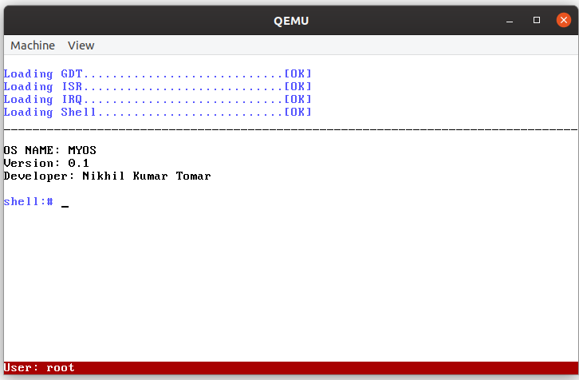

# AetherOS v2.0 - Advanced Operating System

AetherOS is an advanced operating system built from scratch using C and assembly language. It features modern OS capabilities including memory management, process control, file systems, networking, and more.

|  |
| :--: |
| *AetherOS v2.0 with Advanced Features* |

## 🚀 Features

### Core System
- **Memory Management**: Dynamic memory allocation with kmalloc/kfree
- **Process Management**: Multi-process support with scheduler
- **File System**: Virtual file system with directories and files
- **Network Stack**: Basic networking with interface management
- **Interrupt Handling**: Hardware interrupt management
- **Timer System**: System clock and scheduling

### Advanced Shell Commands
- **System**: `about`, `version`, `uptime`, `reboot`, `shutdown`
- **Memory**: `meminfo` - Show memory usage and statistics
- **Process**: `ps` - List running processes, `kill` - Terminate processes
- **Files**: `ls`, `mkdir`, `rm`, `cat`, `touch` - File operations
- **Network**: `netstat`, `ping` - Network diagnostics
- **Utilities**: `calc`, `echo`, `clear`, `help`

### System Architecture
- **Kernel**: Monolithic kernel with modular design
- **Boot**: Custom bootloader with system initialization
- **Hardware**: x86-32 architecture support
- **Memory**: 16MB RAM with dynamic allocation
- **Storage**: In-memory file system

## 🛠️ Requirements
1. **nasm** - Netwide Assembler
2. **gcc** - GNU Compiler Collection
3. **ld** - GNU Linker
4. **qemu-system-x86_64** - QEMU Emulator

## 🚀 Quick Start

### Build and Run
```bash
# Build and run AetherOS
make all

# Or use the convenient script
./run_os.sh
```

### Manual Build Steps
```bash
# Build loader
make loader

# Build kernel
make kern

# Link everything
make link

# Run in QEMU
make run
```

## 📁 Project Structure
```
AetherOS/
├── kernel/           # Kernel source code
│   ├── kernel.c      # Main kernel
│   ├── memory.c      # Memory management
│   ├── process.c     # Process management
│   ├── filesystem.c  # File system
│   ├── network.c     # Network stack
│   └── loader.asm    # Kernel loader
├── cpu/              # CPU-specific code
│   ├── idt.c         # Interrupt Descriptor Table
│   ├── irq.c         # Interrupt Request handling
│   ├── timer.c       # Timer management
│   └── kb.c          # Keyboard driver
├── include/          # Common headers
│   ├── print.c       # Display functions
│   ├── string.c      # String utilities
│   └── ports.c       # I/O port access
├── user/             # User-space components
│   ├── shell/        # Command shell
│   └── taskbar/      # System taskbar
├── boot/             # Boot sector
└── Makefile          # Build system
```

## 🎮 Usage

Once AetherOS boots, you'll see the shell prompt:
```
shell:# 
```

Try these commands:
- `help` - Show all available commands
- `about` - System information
- `meminfo` - Memory usage
- `ps` - Running processes
- `ls` - List files
- `netstat` - Network status

## 🔧 Development

### Adding New Features
1. Create new source files in appropriate directories
2. Update Makefile to include new files
3. Add function declarations to headers
4. Initialize new systems in kernel/kernel.c

### Debugging
- Use QEMU monitor (Ctrl+Alt+2) for debugging
- Check boot messages for system status
- Use print statements for tracing

## 📈 Roadmap
- [ ] Multi-threading support
- [ ] Extended file system (ext2-like)
- [ ] Network protocols (TCP/IP)
- [ ] Graphics mode support
- [ ] USB driver support
- [ ] Audio system

## 🤝 Contributing
Contributions are welcome! Please feel free to submit issues and pull requests.

## 📄 License
This project is for educational purposes.

---
**AetherOS v2.0** - Advanced Operating System from Scratch
